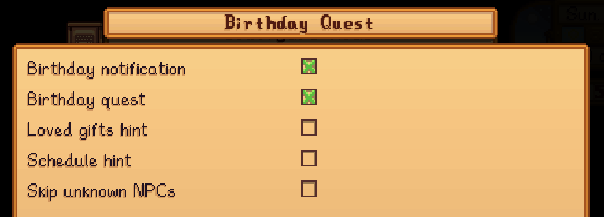

# Stardew Valley Birthday Quest Mod

A mod for Stardew Valley that reminds you when it's someone's birthday and adds 1-day "birthday gift" task to you quest board.

Perfect for people who always forget to give birthday presents!


e.g. on Spring 14 (Haley's birthday)...
1. when you wake up, the game shows a dialogue box reminding you it's Haley's birthday
2. adds a "birthday gift for Haley" limited time quest to your active quest log
3. (optional by config) shows Haley's loved gifts within the quest


## Downloads
Download it here: https://www.nexusmods.com/stardewvalley/mods/46184 or go to releases for the zip.

## How can I enable loved gifts hint?

You can enable it in the config. Config is located in BirthdayQuest/config.json.
Change the third line to:
```
  "LovedGiftsHint": true
```

## How can I enable schedule hint?

You can enable it in the config. Config is located in BirthdayQuest/config.json.
Change the fourth line to:
```
  "NpcScheduleHint": true
```

Available Config options:

- `BirthdayNotification`: shows a wake-up message when today is an NPC's birthday. Default: `true`.
- `BirthdayQuest`: adds a one-day birthday gift quest to your quest log. Default: `true`.
- `LovedGiftsHint`: adds a list of loved gifts to the birthday quest text. Default: `false`.
- `NpcScheduleHint`: adds the birthday NPC's schedule to the birthday quest text. Default: `false`.

You can also use GMCM (see below) to edit config values:

## Generic Mod Config Menu (GMCM) support (optional)

If you have [Generic Mod Config Menu](https://www.nexusmods.com/stardewvalley/mods/5098) installed, you can edit config values within the GMCM menu.

- if on title screen: click cog button on bottom left -> click Birthday Quest
- if in game: esc -> click controller icon -> scroll to bottom -> click Mod Options -> click Birthday Quest




### TODOs
- [x] add recommended gift (by taste) to dialoge/ quest - added toggle on from config.json
- [x] add support for Generic Mod Config Menu (GMCM)
- [x] fix pronouns
- [x] fix no "birthday gift" dialogue from NPC
- [x] fix birthday quests showing up on quest board
- [x] fix finishing birthday quest giving prize ticket
- [x] add cross mod compatibility
- [x] add npc schedule to quest
- [x] bug: gift tastes are using mod item names instead of display name
- [x] bug: modded char names using raw name instead of display name
- [ ] bug: Quest completes after giving any character a gift, not just the birthday person


- [ ] add translation compatibility - check https://github.com/ernfu/StardewBirthdayQuest/pull/2/changes.
- [ ] add gh release to UpdateKeys